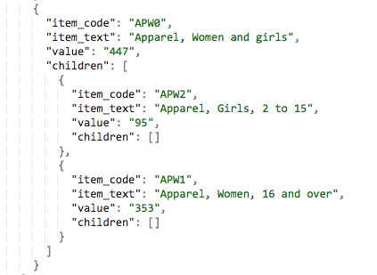

# Pratical Exam Submission, Sonyl Nagale

## < sonyl@nagale.com > , 323.793.3369

##  Current State

>  ## Current State

>Attached are three files containing three JSON objects:

>* Object1.json
>* Object2.json
>* Object3.json

>The tree structure of each object is identical, except that each item in each JSON object contains a different value for the ```"value"``` key; e.g.:

>* ```"value":"2191"```
>* ```"value":"2336"```
>* ```"value":"2447"```

There are actually slight errors in the original data files. For example, consider this from [Object2.json](./Object2json):



We can see that `95 + 353` != `447`, but rather equals `448`. This miscaluclation in the original data informs my approach, as outlined below.

## Approach

Given the calculation errors pointed out above, my approach does not blindly merge values in the tree but rather recursively adds each child to form the parent value.

### Breakdown


```js
const jsonfile = require('jsonfile');
const util = require('util');
const fs = require('fs');

const datafiles = ['Object1.json','Object2.json','Object3.json'];
```

The array of datafiles is hardcoded for the purposes of this exercise but could easily read from the filesystem. Additionally, the use of an array allows us to dynamically grow and shrink the input, as we see below in the use of our first `for` loop.

```js
let jsonData = [];

main();

function main() {
  let readPromise = readFiles(datafiles);
```

We use promises to ensure the reading of the files from disk won't pose a problem.

```js
  readPromise.then(function() {

    for (let i = 0; i < jsonData.length; i++) {
      let counter = 0;

      while (counter < jsonData[i].length) {
        if (i !== 0) {
          if (jsonData[0][counter].children) {
            combineChildren(jsonData[0][counter], jsonData[i][counter]);
          }

```

If we have children, we need to do additional work to ensure we're calculating the sums correctly. `combineChildren` will be a recursive function, as we will see below.

```js
        } else {
          jsonData[0][counter].value = Number(jsonData[0][counter].value);
        }
```

Otherwise, all we need to do is typecast.

```js

        counter++;
      }
    }

    fs.writeFile('myjsonfile.json', JSON.stringify(jsonData[0]), 'utf-8', function(err) {
      if (err) {
        throw err;
      } else {
        console.log('ok');
      }
    });

  }, function(err) {
    console.log(err);
  });
}

```

Our `combineChildren` function is designed to be called recursively, so it takes in any two nodes. The first node is designed to be the base node (that is, an object from `Object1.json`) to be combined with its siblings from the other JSON files.

```js
function combineChildren(baseNode, newNode) {
  baseNode.value = Number(baseNode.value);
  if (newNode) {
    baseNode.value += Number(newNode.value);
  }

  if (!baseNode.children) {
    return;
  }

  let nodeChildren = baseNode.children.length;

  if (nodeChildren > 0) {

    for (let i = 0; i < nodeChildren; i++) {
      combineChildren(baseNode.children[i], newNode.children[i]);

      if (newNode.children.length > 0) {
        baseNode.children.concat(newNode.children);
        let newValue = 0;
        for (let j = 0; j < baseNode.children.length; j++) {
          newValue += baseNode.children[j].value;
        }

        baseNode.value = newValue;
      }

    }
  }
}

function readFile(file) {
  return new Promise(function(resolve,reject) {
    jsonfile.readFile(file, function(err, obj) {
      if (err) {
        console.log(err);
        reject();
      } else {
        resolve(jsonData.push(obj));
      }
    });
  });
}

function readFiles(files) {
  let finished = 0;

  return new Promise(function(resolve,reject) {
    for (let i = 0;  i < files.length; i++) {
      let filePromise = readFile(files[i]);
      filePromise.then(function(result) {
        finished++;
        if (finished === files.length) {
          resolve();
        }
      }, function(err) {
        console.log(err);
      });
    }
  });
}
```

## Final State

I didn't go through the exercise of typecasting the values back to strings, as I find leaving them as-is is still valid JSON (and arguably easier to work with downstream). We can note improvements in calculation, albeit at a bit of a performance hit. The Big O of this solution is _not_ impressive. I believe the complexity is at worst O(n^2), which makes this unsuitable for production usage on large datasets. However, I would not advocate using a monolithic solution like this on its own; this is a demonstration. A more refined approach would be to use a database that can use a mapReduce in order to generate its numbers in a more scalable manner.


## Installation and Execution

This is a basic Node.js application and can be run by cloning the repository, executing `npm install` followed by `npm start`. The output is rendered to `myjsonfile.json`.

## Notes

I did not create a test suite for this problem. Under normal circumstances for production code, this would warrant one.


## Thank you
